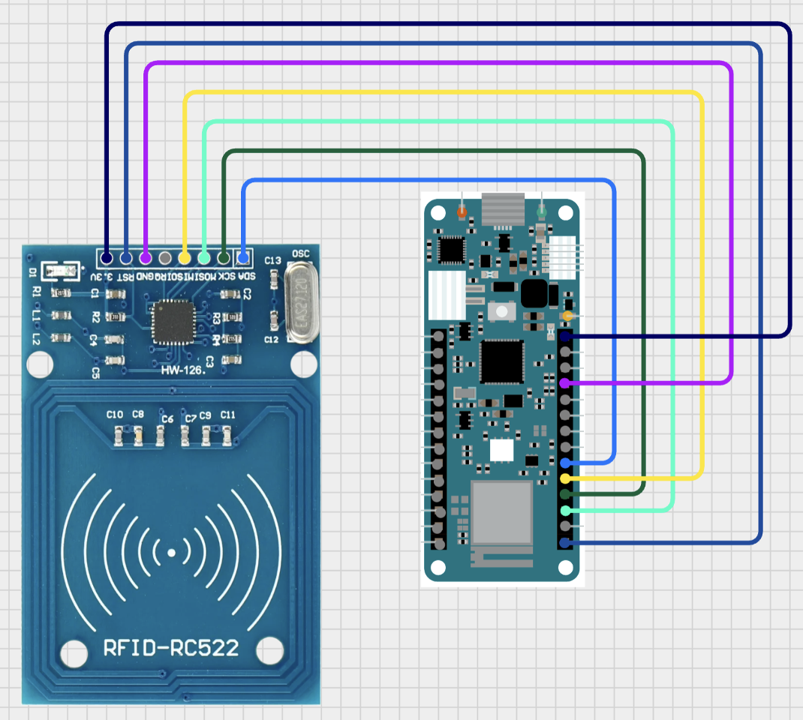

# Workshop files
In the following you can see the used `playbook` for the demonstration (excluded the Proxmark3 RDV4 demo part).

## Prerequisits
For this specific code you have to consider how the memory blocks are arranged in the RFID tag. Furthermore it's important to have a UID-writable RFID tag. The Lab401 `MIFARE Ultralight Compatible Direct Write UID` tag, which was used in the demonstration (available under: https://lab401.com/products/ultralight-compatiblr-direct-write-uid?_pos=15&_sid=d188d7e36&_ss=r) is suitable for this code.

Also required for the correct functionioning of the demonstration, especially for the build-in LED, which switches from red to green, an Arduino MKR WiFi 1010.

The module used in the demonstration, which were capable of reading out this RFID tags was the RC-522 module. There are plenty of alternatives to this product.

The wiring should be made like this:<br>


## Playbook practice part table top OT
1. Demonstrate the memorylayout of different RFID tags (normal blue one and LAB401 RFID tag)
   - This can be done with the `DumpOfMemory` project.<br>
     This looks like the following:<br>
     ```
     Firmware Version: 0xB2 = (unknown)
     Scan PICC to see UID, SAK, type, and data blocks...
     Card UID: 04 15 91 2A 76 F9 18
     Card SAK: 00
     PICC type: MIFARE Ultralight or Ultralight C
     Page   0  1  2  3
       0    04 15 91 08
       1    2A 76 F9 18
       2    BD 48 00 00
       3    00 00 00 00
       4    00 00 00 00
       5    00 00 00 00
       6    00 00 00 00
       7    00 00 00 00
       8    00 00 00 00
       9    00 00 00 00
       10   00 00 00 00
       11   00 00 00 00
       12   00 00 00 00
       13   00 00 00 00
       14   00 00 00 00
       15   00 00 00 00
     ```

     Or this:<br>
     ```
     ...
     3     15   00 00 00 00  00 00 FF 07  80 69 FF FF  FF FF FF FF 
           14   00 00 00 00  00 00 00 00  00 00 00 00  00 00 00 00 
           13   00 00 00 00  00 00 00 00  00 00 00 00  00 00 00 00 
           12   00 00 00 00  00 00 00 00  00 00 00 00  00 00 00 00 
     2     11   00 00 00 00  00 00 FF 07  80 69 FF FF  FF FF FF FF 
           10   00 00 00 00  00 00 00 00  00 00 00 00  00 00 00 00 
            9   00 00 00 00  00 00 00 00  00 00 00 00  00 00 00 00 
            8   00 00 00 00  00 00 00 00  00 00 00 00  00 00 00 00 
     1      7   00 00 00 00  00 00 FF 07  80 69 FF FF  FF FF FF FF 
            6   00 00 00 00  00 00 00 00  00 00 00 00  00 00 00 00 
            5   00 00 00 00  00 00 00 00  00 00 00 00  00 00 00 00 
            4   00 00 00 00  00 00 00 00  00 00 00 00  00 00 00 00 
     0      3   00 00 00 00  00 00 FF 07  80 69 FF FF  FF FF FF FF 
            2   00 00 00 00  00 00 00 00  00 00 00 00  00 00 00 00 
            1   00 00 00 00  00 00 00 00  00 00 00 00  00 00 00 00 
            0   4C 32 BB 6E  AB 08 04 00  62 63 64 65  66 67 68 69 
        ```
2. Than change the UID of Tag 1 from Lab401 to the value which is hard coded in the code for authentication called `ChangeUIDLab401RFID`:
    - Currently it is this value:
      ```c++
      byte newUid[7] = { 0x04, 0x15, 0x91, 0x2A, 0x76, 0xF9, 0x18 };
      ```
3. Than compile and upload `BasicsAuthUIDIllustration` and demonstrate with the Lab401 RFID tag that the light switches for 10 seconds from red to green and with the other tag not.